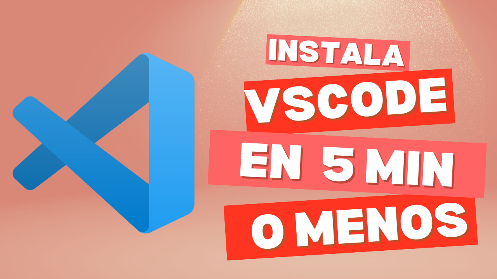
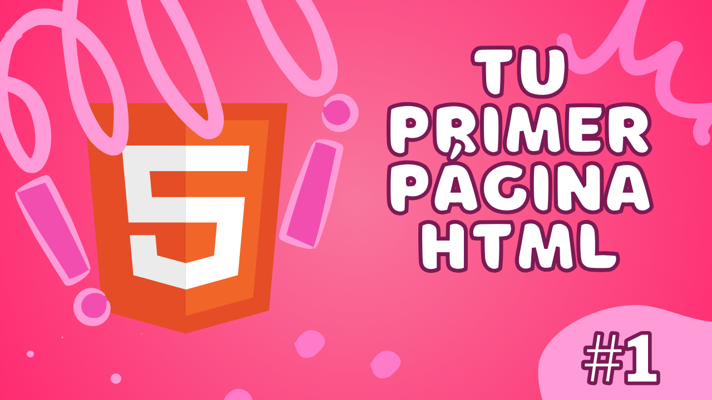

<h1 align="center">Hola, soy Karla 👋</h1>

## Sobre mi

° 💻 VScode Developer 
° 🔭 Actualmente trabajando con VScode 
° 🌱 Actualmente aprendiendo más código 
° 👩🏽‍💻 Estudiante de Programación 
° ✨ Te enseño a programar en mi canal de YouTube (CodeCraftKaro) 
° 😄 Pronouns: she/her

 

## Experiencia en

° 💻 Páginas en HTML 
° 🌅 Diseño/estilos en CSS 
° 🌱 JavaScript 
° 👩🏽‍💻 C++ 
° 💫 Java 
° 💜 Eclipse IDE, Brackets , NeatBeans IDE, VScode 

 

### ⚙️ &nbsp;GitHub Analytics

 

## Proyectos *Code Craft*

<table>
<tr>
<td width="50%">
<h3 align="center">¿Cómo Instalar VISUAL STUDIO CODE en menos de 5 MINUTOS?</h3>

Aprende a como instalar <strong>Visual Studio Code</strong> en menos de <strong>5 MINUTOS</strong> de manera muy sencilla.

                                                                                      
</td>

<td width="50%">
                
<h3 align="center">Arquitectura MVVM</h3>

                                       

 

Crea tu primer <strong>PÁGINA CON HTML </strong> en VScode.

                                                             
</table>  

 